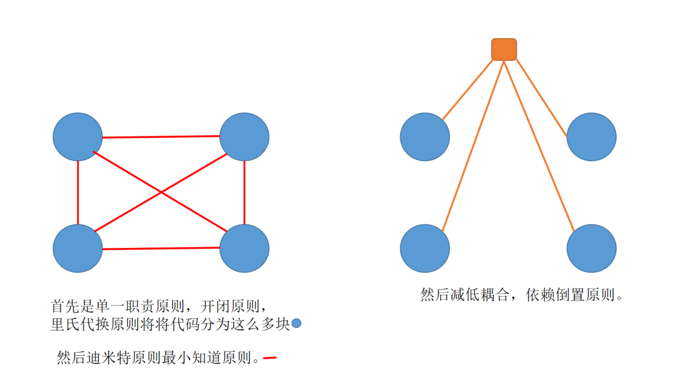

### 什么是设计模式，原则

**什么是设计模式？**

设计模式（Design Pattern）是一套被反复使用，多数人知晓的，经过分类的，代码设计经验的总结。

就是相处套路做事情。

**模式是什么？**

模式-模式是指从生产经验和生活经验中经过抽象和升华提炼出来的核心知识体系。模式（Pattern）其实就是解决某一类问题的方法论。

**设计模式的目的**

使用设计模式的目的：为了代码可重用性、让代码更容易被他人理解、保证代码可靠性。设计模式使代码编写真正工程化; 设计模式使设计模式是**软件工程**的基石脉络、如同大厦的结构一样。

**总结一下：**

没有套路做事情没效率、很笨拙、重用性小、情况再复杂的时候难度就很多、有了套路更容易的解决一些复杂的问题、让开发变得更高效。

-----

**创建型--研究高效的创建对象**

单例模式、 抽象工厂模式、 建造者模式、 工厂模式、 原型模式。

**结构型模式--设计对象的结构和关系**

适配器模式、桥接模式、装饰模式、组合模式、外观模式、享元模式、代理模式。

**行为模式--设计对象的行为**

模板方法模式、命令模式、迭代器模式、观察者模式、中介模式、备忘录模式、解释器模式、状态模式、策略模式、职责链模式、访问者模式。

------------------------------

**设计模式的六大原则**

减少耦合、增强复用性、降低代码的开发维护扩展成本。

**设计模式的六大原则目的：降低代码的复杂程度合理的减少耦合度。**

----------------------------

**简单说一下耦合**

耦合关系是指某两个事物之间如果存在一种相互作用、相互影响的关系、那么这种关系就称**耦合度**

**耦合度和复杂度的危害**

复杂度：高，代码质量不高，可维护性差，复用性差，不易扩展。

耦合度：无 不可能，低 合理， 过高不容易维护。但复用性和扩展性强。

-----------------------------

**开发时的流程**

> 优先降低复杂度，尽量降低耦合度。

尽可能降低复杂度，然后在降低耦合度。

《很多时候》降低复杂度的时候，基本上是增加耦合度来降低的。

**设计模式六大原则：单一职责原则、开闭原则、里氏代换原则、迪米特法则、依赖倒置原则DIP、接口分离原则**

**一：利用单一职责原则、开闭原则、里氏代换原则 降低复杂度。**

**二：通过迪米特法则减少耦合度**

**三：通过依赖倒置原则消除可以没有用的耦合**

---------------------------

**单一职责原则**：一个方法只做一件事情、请求数据的函数就不要渲染数据了。

**开闭原则OCP**：一个软件实体如类、模块和函数应该对扩展开放，对修改关闭。

面向扩展开放，面向修改关闭,就如jquery extend, 同时增强代码复用性。

**里氏代换原则**：任何基类可以出现的地方，子类一定也可以出现。通俗来讲就是：子类可以扩展父类的功能，但不能修改父类原有的功能。里氏代换原则是对开闭原则的补充。

一个父类可以访问的接口，父类忙着其他事情，子类可以去访问。

**迪米特法则：（最小知道原则）LD**

一个接口和一个方法，传入的参数越少越好，降低耦合度的同时也会让复杂长度降低。

举个栗子：谍战片中间谍，两个同伙间谍互相不知道，为什么要这样呢？是为了最大程度减少伤害，死只死一条线人，形成的关联越少越好，依赖最少。

**依赖倒置原则：DIP**

最常用的原则，依赖接口，不依赖方法，底层的东西不用了解，我门值需要知道表现就可以。降低耦合度。

前端应用中可以理解成多者之间依赖状态，而不依赖彼此。

> JS中没有接口的概念。

依赖倒置原则，就是做A 和 B 通信用说话的形式则是耦合，然而现在换成A 和 B 通信是通过中介的话，则是依赖倒置原则。不依赖彼此，而依赖状态。

**接口分离原则 isp**

把大接口拆分小接口，不能一个接口全部实现增删改查。

举个栗子：比如我写作业，要细分成，写数学，写英语，写语文等作业，同时降低耦合度了。

图片说明：

----------

心得：代码质量的高度是素质，学会权衡才是高价值的开发经验。

------

**先原则，再模式**

原则是理论，模式是在理论上的具体方式。

如： 我希望并建议你考试100分，但都是理论具体还需要落实咋实际方式方法上，但不可以追求，其中有时间成本问题，用更多时间去玩还能保证不低的分数也是可以的。

知行合一，难点在知，实践其次。

----